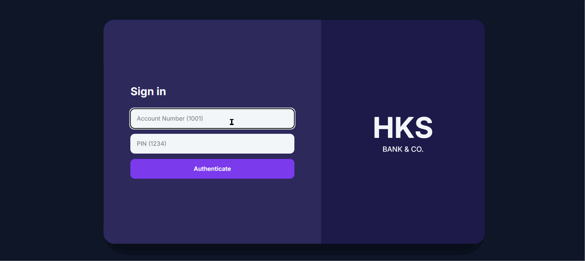

npm start
    ```

## 🛠️ Technology Stack

*   **Node.js & Express.js:** For the asynchronous, non-blocking API gateway.
*   **MySQL:** For relational data integrity and ACID-compliant Stored Procedures.
*   **JavaScript (ES6+):** For the custom SPA router and client-side state management.
*   **Chart.js:** For rendering real-time financial data visualizationsTo match the format, structure, and aesthetic of your **SegDPVisualizer** documentation, here is the `README.md` for **HKS Bank & Co.** 

---

# HKS Bank & Co. | Enterprise Banking Architecture

A high-fidelity, interactive **Single Page Application (SPA)** banking portal designed to demonstrate robust backend engineering, focusing on **ACID compliance** and **pessimistic concurrency control**.

This project provides a technical deep-dive into how **MySQL Stored Procedures** and **row-level locking** can be used to build a secure, transactionally integral financial system that prevents data corruption in high-frequency environments.

## 🎯 About The Project

This project simulates a secure retail banking environment where data integrity is the highest priority:

> **The Problem:** In a multi-user environment, two users might attempt to withdraw or transfer funds from the same account at the exact same millisecond. Without proper locking, this leads to **Race Conditions**, where the database reads an old balance before the previous transaction has finished, resulting in "double-spending."

HKS Bank & Co. solves this by implementing an architecture that moves critical logic from the application layer into the database layer, ensuring every transaction is atomic and isolated.

## ✨ Features

*   **Atomic Fund Transfers:** Leverages **MySQL Stored Procedures** to ensure that a transfer (Deduct -> Add -> Audit Log) either completes entirely or fails as a single unit.
*   **Race Condition Prevention:** Implements **`FOR UPDATE` row-level locking**. Watch the system queue concurrent requests to prevent balance corruption.
*   **Decoupled SPA Architecture:** A custom **Vanilla JS** router manages state and navigation without page reloads.
*   **Bento-Grid Dashboard:** A real-time UI featuring financial visualization via **Chart.js** and secure audit logging.
*   **Data Isolation:** RESTful API endpoints filter sensitive transaction data based on the authenticated user's ID.

## 💡 The Engineering Logic Explained

### 1. The Challenge: Concurrency
If two processes read a balance of **$1000** simultaneously and both try to withdraw **$600**, a standard `UPDATE` query might allow both, leaving the account at **-$200**.

### 2. The Solution: Pessimistic Locking
We implement **Pessimistic Locking** using the `SELECT ... FOR UPDATE` syntax within a transaction:
1.  **Lock:** The database locks the specific row for the sender.
2.  **Wait:** Any other transaction trying to access that row is put into a "Wait" state.
3.  **Execute:** The balance is checked, updated, and the transaction is `COMMITTED`.
4.  **Release:** The lock is released for the next transaction in the queue.

### 3. ACID Compliance
By wrapping our SQL logic in `START TRANSACTION` and `ROLLBACK` protocols, we guarantee:
*   **Atomicity:** All steps succeed, or none do.
*   **Consistency:** The database remains in a valid state.
*   **Isolation:** Transactions do not interfere with each other.
*   **Durability:** Committed data is permanent, even during a server crash.

## 🚀 Getting Started

To get a local copy of this enterprise architecture running, follow these steps.

1.  **Clone the repo:**
    ```sh
    git clone https://github.com/itsmeharshkumarsingh/HKS-Bank-Co.git
    ```
2.  **Navigate to the directory:**
    ```sh
    cd HKS-Bank-Co
    ```
3.  **Install Dependencies:**
    ```sh
    npm install
    ```
4.  **Configure Environment:** Create a `.env` file with your `DB_HOST`, `DB_USER`, and `DB_PASS`.
5.  **Initialize Database:** Run the provided `schema.sql` to set up tables and Stored Procedures.
6.  **Launch:**
    ```sh
    npm start
    ```

## 🛠️ Technology Stack

*   **Node.js & Express.js:** For the asynchronous, non-blocking API gateway.
*   **MySQL:** For relational data integrity and ACID-compliant Stored Procedures.
*   **JavaScript (ES6+):** For the custom SPA router and client-side state management.
*   **Chart.js:** For rendering real-time financial data visualizations.

## 🖼️ Demo



---

## Contributing

As this is a proprietaryTo match the format, structure, and aesthetic of your **SegDPVisualizer** documentation, here is the `README.md` for **HKS Bank & Co.** 

---

# HKS Bank & Co. | Enterprise Banking Architecture

A high-fidelity, interactive **Single Page Application (SPA)** banking portal designed to demonstrate robust backend engineering, focusing on **ACID compliance** and **pessimistic concurrency control**.

This project provides a technical deep-dive into how **MySQL Stored Procedures** and **row-level locking** can be used to build a secure, transactionally integral financial system that prevents data corruption in high-frequency environments.

## 🎯 About The Project

This project simulates a secure retail banking environment where data integrity is the highest priority:

> **The Problem:** In a multi-user environment, two users might attempt to withdraw or transfer funds from the same account at the exact same millisecond. Without proper locking, this leads to **Race Conditions**, where the database reads an old balance before the previous transaction has finished, resulting in "double-spending."

HKS Bank & Co. solves this by implementing an architecture that moves critical logic from the application layer into the database layer, ensuring every transaction is atomic and isolated.

## ✨ Features

*   **Atomic Fund Transfers:** Leverages **MySQL Stored Procedures** to ensure that a transfer (Deduct -> Add -> Audit Log) either completes entirely or fails as a single unit.
*   **Race Condition Prevention:** Implements **`FOR UPDATE` row-level locking**. Watch the system queue concurrent requests to prevent balance corruption.
*   **Decoupled SPA Architecture:** A custom **Vanilla JS** router manages state and navigation without page reloads.
*   **Bento-Grid Dashboard:** A real-time UI featuring financial visualization via **Chart.js** and secure audit logging.
*   **Data Isolation:** RESTful API endpoints filter sensitive transaction data based on the authenticated user's ID.

## 💡 The Engineering Logic Explained

### 1. The Challenge: Concurrency
If two processes read a balance of **$1000** simultaneously and both try to withdraw **$600**, a standard `UPDATE` query might allow both, leaving the account at **-$200**.

### 2. The Solution: Pessimistic Locking
We implement **Pessimistic Locking** using the `SELECT ... FOR UPDATE` syntax within a transaction:
1.  **Lock:** The database locks the specific row for the sender.
2.  **Wait:** Any other transaction trying to access that row is put into a "Wait" state.
3.  **Execute:** The balance is checked, updated, and the transaction is `COMMITTED`.
4.  **Release:** The lock is released for the next transaction in the queue.

### 3. ACID Compliance
By wrapping our SQL logic in `START TRANSACTION` and `ROLLBACK` protocols, we guarantee:
*   **Atomicity:** All steps succeed, or none do.
*   **Consistency:** The database remains in a valid state.
*   **Isolation:** Transactions do not interfere with each other.
*   **Durability:** Committed data is permanent, even during a server crash.

## 🚀 Getting Started

To get a local copy of this enterprise architecture running, follow these steps.

1.  **Clone the repo:**
    ```sh
    git clone https://github.com/itsmeharshkumarsingh/HKS-Bank-Co.git
    ```
2.  **Navigate to the directory:**
    ```sh
    cd HKS-Bank-Co
    ```
3.  **Install Dependencies:**
    ```sh
    npm install
    ```
4.  **Configure Environment:** Create a `.env` file with your `DB_HOST`, `DB_USER`, and `DB_PASS`.
5.  **Initialize Database:** Run the provided `schema.sql` to set up tables and Stored Procedures.
6.  **Launch:**
    ```sh
    npm start
    ```

## 🛠️ Technology Stack

*   **Node.js & Express.js:** For the asynchronous, non-blocking API gateway.
*   **MySQL:** For relational data integrity and ACID-compliant Stored Procedures.
*   **JavaScript (ES6+):** For the custom SPA router and client-side state management.
*   **Chart.js:** For rendering real-time financial data visualizations.

## 🖼️ Demo


---

## Contributing

As this is a proprietary architectural showcase for SDE interview cycles, external contributions are currently restricted. However, architectural feedback is welcome!

1.  Fork the Project
2.  Create your Feature BranchTo match the format, structure, and aesthetic of your **SegDPVisualizer** documentation, here is the `README.md` for **HKS Bank & Co.** 

---

# HKS Bank & Co. | Enterprise Banking Architecture

A high-fidelity, interactive **Single Page Application (SPA)** banking portal designed to demonstrate robust backend engineering, focusing on **ACID compliance** and **pessimistic concurrency control**.

This project provides a technical deep-dive into how **MySQL Stored Procedures** and **row-level locking** can be used to build a secure, transactionally integral financial system that prevents data corruption in high-frequency environments.

## 🎯 About The Project

This project simulates a secure retail banking environment where data integrity is the highest priority:

> **The Problem:** In a multi-user environment, two users might attempt to withdraw or transfer funds from the same account at the exact same millisecond. Without proper locking, this leads to **Race Conditions**, where the database reads an old balance before the previous transaction has finished, resulting in "double-spending."

HKS Bank & Co. solves this by implementing an architecture that moves critical logic from the application layer into the database layer, ensuring every transaction is atomic and isolated.

## ✨ Features

*   **Atomic Fund Transfers:** Leverages **MySQL Stored Procedures** to ensure that a transfer (Deduct -> Add -> Audit Log) either completes entirely or fails as a single unit.
*   **Race Condition Prevention:** Implements **`FOR UPDATE` row-level locking**. Watch the system queue concurrent requests to prevent balance corruption.
*   **Decoupled SPA Architecture:** A custom **Vanilla JS** router manages state and navigation without page reloads.
*   **Bento-Grid Dashboard:** A real-time UI featuring financial visualization via **Chart.js** and secure audit logging.
*   **Data Isolation:** RESTful API endpoints filter sensitive transaction data based on the authenticated user's ID.

## 💡 The Engineering Logic Explained

### 1. The Challenge: Concurrency
If two processes read a balance of **$1000** simultaneously and both try to withdraw **$600**, a standard `UPDATE` query might allow both, leaving the account at **-$200**.

### 2. The Solution: Pessimistic Locking
We implement **Pessimistic Locking** using the `SELECT ... FOR UPDATE` syntax within a transaction:
1.  **Lock:** The database locks the specific row for the sender.
2.  **Wait:** Any other transaction trying to access that row is put into a "Wait" state.
3.  **Execute:** The balance is checked, updated, and the transaction is `COMMITTED`.
4.  **Release:** The lock is released for the next transaction in the queue.

### 3. ACID Compliance
By wrapping our SQL logic in `START TRANSACTION` and `ROLLBACK` protocols, we guarantee:
*   **Atomicity:** All steps succeed, or none do.
*   **Consistency:** The database remains in a valid state.
*   **Isolation:** Transactions do not interfere with each other.
*   **Durability:** Committed data is permanent, even during a server crash.

## 🚀 Getting Started

To get a local copy of this enterprise architecture running, follow these steps.

1.  **Clone the repo:**
    ```sh
    git clone https://github.com/itsmeharshkumarsingh/HKS-Bank-Co.git
    ```
2.  **Navigate to the directory:**
    ```sh
    cd HKS-Bank-Co
    ```
3.  **Install Dependencies:**
    ```sh
    npm install
    ```
4.  **Configure Environment:** Create a `.env` file with your `DB_HOST`, `DB_USER`, and `DB_PASS`.
5.  **Initialize Database:** Run the provided `schema.sql` to set up tables and Stored Procedures.
6.  **Launch:**
    ```sh
    npm start
    ```

## 🛠️ Technology Stack

*   **Node.js & Express.js:** For the asynchronous, non-blocking API gateway.
*   **MySQL:** For relational data integrity and ACID-compliant Stored Procedures.
*   **JavaScript (ES6+):** For the custom SPA router and client-side state management.
*   **Chart.js:** For rendering real-time financial data visualizations.

## 🖼️ Demo


---

## Contributing

As this is a proprietary architectural showcase for SDE interview cycles, external contributions are currently restricted. However, architectural feedback is welcome!

1.  Fork the Project
2.  Create your Feature Branch (`git checkout -b feature/Optimization`)
3.  Commit your Changes (`git commit -m 'Optimized SQL JOIN logic'`)
4.To match the format, structure, and aesthetic of your **SegDPVisualizer** documentation, here is the `README.md` for **HKS Bank & Co.** 

---

# HKS Bank & Co. | Enterprise Banking Architecture

A high-fidelity, interactive **Single Page Application (SPA)** banking portal designed to demonstrate robust backend engineering, focusing on **ACID compliance** and **pessimistic concurrency control**.

This project provides a technical deep-dive into how **MySQL Stored Procedures** and **row-level locking** can be used to build a secure, transactionally integral financial system that prevents data corruption in high-frequency environments.

## 🎯 About The Project

This project simulates a secure retail banking environment where data integrity is the highest priority:

> **The Problem:** In a multi-user environment, two users might attempt to withdraw or transfer funds from the same account at the exact same millisecond. Without proper locking, this leads to **Race Conditions**, where the database reads an old balance before the previous transaction has finished, resulting in "double-spending."

HKS Bank & Co. solves this by implementing an architecture that moves critical logic from the application layer into the database layer, ensuring every transaction is atomic and isolated.

## ✨ Features

*   **Atomic Fund Transfers:** Leverages **MySQL Stored Procedures** to ensure that a transfer (Deduct -> Add -> Audit Log) either completes entirely or fails as a single unit.
*   **Race Condition Prevention:** Implements **`FOR UPDATE` row-level locking**. Watch the system queue concurrent requests to prevent balance corruption.
*   **Decoupled SPA Architecture:** A custom **Vanilla JS** router manages state and navigation without page reloads.
*   **Bento-Grid Dashboard:** A real-time UI featuring financial visualization via **Chart.js** and secure audit logging.
*   **Data Isolation:** RESTful API endpoints filter sensitive transaction data based on the authenticated user's ID.

## 💡 The Engineering Logic Explained

### 1. The Challenge: Concurrency
If two processes read a balance of **$1000** simultaneously and both try to withdraw **$600**, a standard `UPDATE` query might allow both, leaving the account at **-$200**.

### 2. The Solution: Pessimistic Locking
We implement **Pessimistic Locking** using the `SELECT ... FOR UPDATE` syntax within a transaction:
1.  **Lock:** The database locks the specific row for the sender.
2.  **Wait:** Any other transaction trying to access that row is put into a "Wait" state.
3.  **Execute:** The balance is checked, updated, and the transaction is `COMMITTED`.
4.  **Release:** The lock is released for the next transaction in the queue.

### 3. ACID Compliance
By wrapping our SQL logic in `START TRANSACTION` and `ROLLBACK` protocols, we guarantee:
*   **Atomicity:** All steps succeed, or none do.
*   **Consistency:** The database remains in a valid state.
*   **Isolation:** Transactions do not interfere with each other.
*   **Durability:** Committed data is permanent, even during a server crash.

## 🚀 Getting Started

To get a local copy of this enterprise architecture running, follow these steps.

1.  **Clone the repo:**
    ```sh
    git clone https://github.com/itsmeharshkumarsingh/HKS-Bank-Co.git
    ```
2.  **Navigate to the directory:**
    ```sh
    cd HKS-Bank-Co
    ```
3.  **Install Dependencies:**
    ```sh
    npm install
    ```
4.  **Configure Environment:** Create a `.env` file with your `DB_HOST`, `DB_USER`, and `DB_PASS`.
5.  **Initialize Database:** Run the provided `schema.sql` to set up tables and Stored Procedures.
6.  **Launch:**
    ```sh
    npm start
    ```

## 🛠️ Technology Stack

*   **Node.js & Express.js:** For the asynchronous, non-blocking API gateway.
*   **MySQL:** For relational data integrity and ACID-compliant Stored Procedures.
*   **JavaScript (ES6+):** For the custom SPA router and client-side state management.
*   **Chart.js:** For rendering real-time financial data visualizations.

## 🖼️ Demo


---

## Contributing

As this is a proprietary architectural showcase for SDE interview cycles, external contributions are currently restricted. However, architectural feedback is welcome!

1.  Fork the Project
2.  Create your Feature Branch (`git checkout -b feature/Optimization`)
3.  Commit your Changes (`git commit -m 'Optimized SQL JOIN logic'`)
4.  Push to the Branch (`git push origin feature/Optimization`)
5.  Open a Pull Request